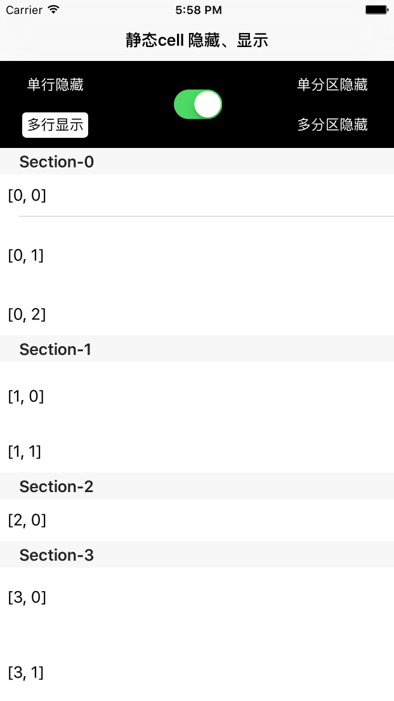

# ZZStaticCellHiddenAndShow
静态cell的显示和隐藏

## 需求

在开发的时候遇到这样一个要求：隐藏和显示UITableViewController上静态cell。在此做了一个封装，可以方便的隐藏和显示cell甚至是分区。

## 想法

把表格上所有的cell捕捉到，并对应相应的数据结构，隐藏和显示时对表格的数据层做处理。思路流程请参见 [这里](./图示/home.html)

## 使用方法
把文件夹UITableViewController+ZZStaticCellHiddenShow托入项目，并在需要使用的地方导入头文件

```
#import "UITableViewController+ZZStaticCellHiddenShow.h"`
[self zz_setCellsHidden:@[_cell_0_0] animated:YES]; // 隐藏单个cell,参数animated可置为YES/NO
[self zz_setCellsHidden:@[_cell_0_1, _cell_3_0, _cell_3_1] animated:YES]; // 隐藏多个cell

[self zz_setSectionsHidden:@[@1...] animated:YES]; // 隐藏分区
[self zz_setSectionsShow:@[@0, ...] animated:YES]; // 显示分区 

```

**详情可参见Demo, 参数animated如果置为NO, 则显示和隐藏cell无动画**



