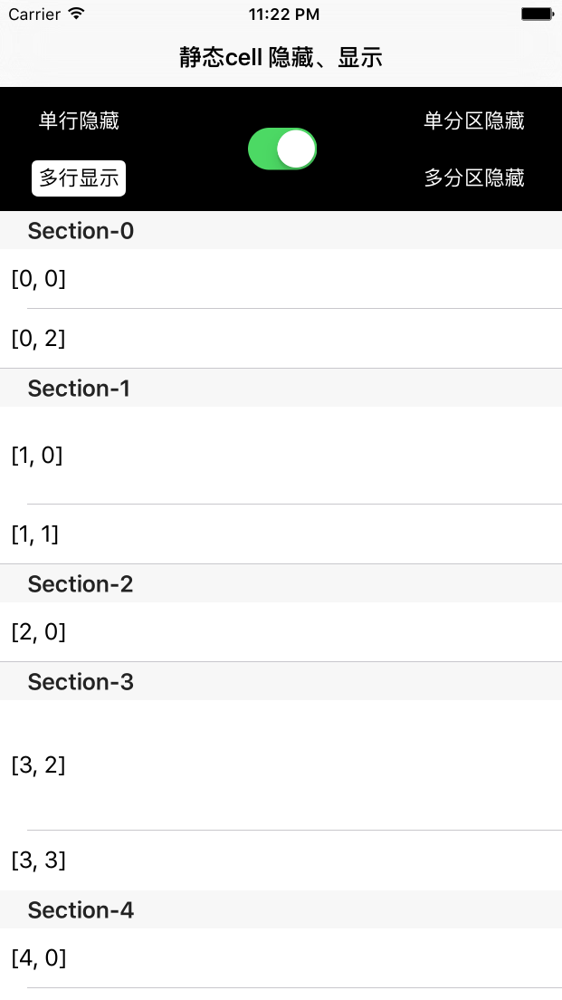
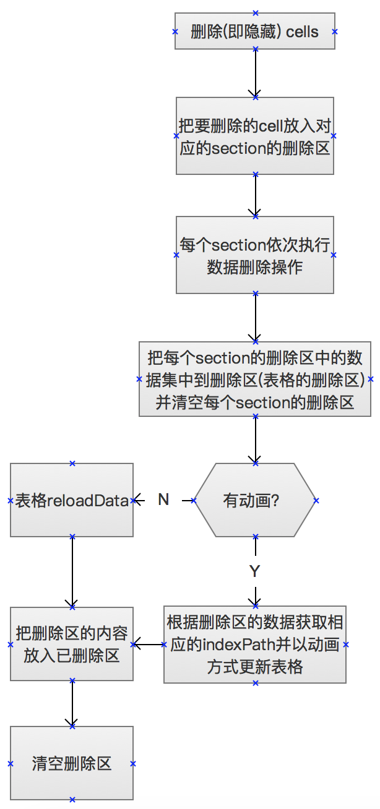
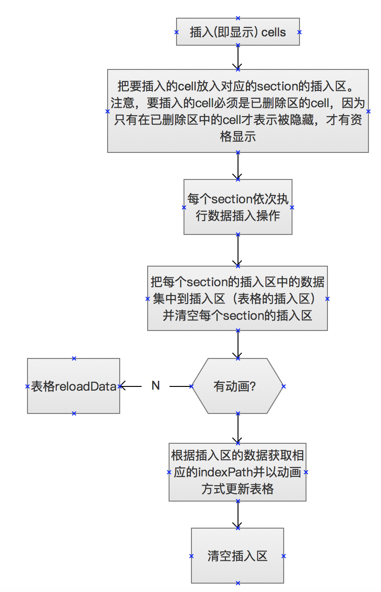

# ZZStaticCellHiddenAndShow
静态cell的显示和隐藏

## 需求

在开发的时候遇到这样一个要求：隐藏和显示UITableViewController上静态cell。在此做了一个封装，可以方便的隐藏和显示cell甚至是分区。


## 使用方法
把文件夹UITableViewController+ZZStaticCellHiddenShow托入项目，并在需要使用的地方导入头文件

```
#import "UITableViewController+ZZStaticCellHiddenShow.h"`
[self zz_setCellsHidden:@[_cell_0_0] animated:YES]; // 隐藏单个cell,参数animated可置为YES/NO
[self zz_setCellsHidden:@[_cell_0_1, _cell_3_0, _cell_3_1] animated:YES]; // 隐藏多个cell

[self zz_setSectionsHidden:@[@1...] animated:YES]; // 隐藏分区
[self zz_setSectionsShow:@[@0, ...] animated:YES]; // 显示分区 

```

**详情可参见Demo, 参数animated如果置为NO, 则显示和隐藏cell无动画**  



## 思路流程

把表格上所有的cell捕捉到，并对应相应的数据结构，隐藏和显示时对表格的数据层做处理。图示:




注：ZZDataTable代表的是表格数据，ZZDataSection代表的是每个分区的数据，ZZDataRow代表每个cell，即每行的数据，在ZZDataRow中hidden表示当前行是否隐藏，height表示行的高度，previous和next分别表示它的上一个行和下一行（使用双向链表的形式），之所以有previous和next, 主要是因为一个重要的属性：indexPath, 每次执行插入和删除操作都需要更新每行（即每个ZZDataRow对象）所对应的indexPath，因为如果需要动画，就需要调用tableView的两个方法： 

```
- insertRowsAtIndexPaths:(NSArray<NSIndexPath *> *)indexPaths withRowAnimation:(UITableViewRowAnimation)animation;
- (void)deleteRowsAtIndexPaths:(NSArray<NSIndexPath *> *)indexPaths withRowAnimation:(UITableViewRowAnimation)animation
```

由于这两个api需要传入确切的indexPaths，所以每次执行插入和删除都要更新，这就需要记录每行最原始的位置，所以采用双向链表的形式，从而记录和更新每行的indexPath


